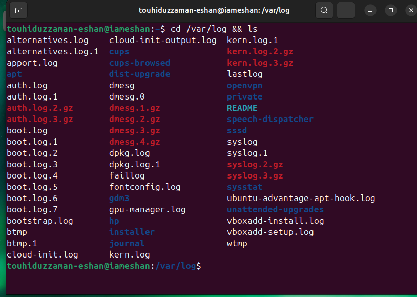
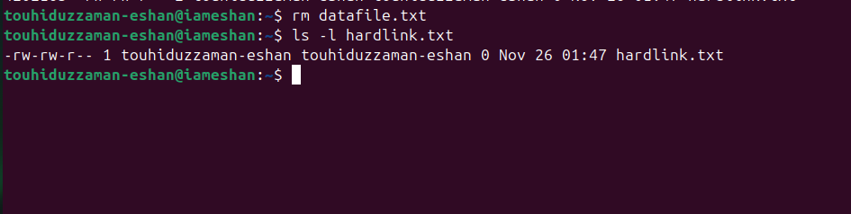

# Linux Command Outputs


### File System Navigation
- **Listing contents of the home directory**:

```bash
    ls ~
```


- **Changing directory to /var/log and listing contents**:
```bash
    cd  /var/log &&ls
```



- **Finding path to bash executable**:
 ```bash
    which bash
```


- **Find current shell**:
 ```bash
    echo $SHELL
```


### File and Directory Operations

- **Creating directory and files**:
```bash
    mkdir linux_fundamentals
```


- **Inside linux_fundamentals, create a subdirectory named scripts.**:
```bash
    cd linux_fundamentals
    mkdir scripts
    ls
```


- **Create an empty file named example.txt inside the linux_fundamentals directory..**:
```bash
    touch example.txt
```


- **Copy example.txt to the scripts directory.**:
```bash
    cp example.txt scripts/
```


- **Move example.txt from linux_fundamentals to linux_fundamentals/backup.
Permissions.**:
```bash
    mkdir backup
    mv example.txt backup/
```


- **Change the permissions of example.txt to read and write for the owner, and read-only for the group and others.**:
```bash
  cd backup/
  chmod 644 example.txt
  ls -l
```


### File Modification

- **Create a file named example.txt in your home directory.**:
```bash
touch example.txt
```


- **Change the owner of example.txt to a user named student.**:
```bash
sudo useradd -m student
sudo chown student example.txt
```


- **Change the group of example.txt to a group named students.**:
```bash
sudo groupadd students
sudo chgrp students example.txt
ls -l example.txt
```


### Ownership


- **Create a directory named project in your home directory.**:
```bash
mkdir project
ls
```


- **Create a file named report.txt inside the project directory.**:
```bash
touch  ~/project/report.txt
```


- **Set the permissions of report.txt to read and write for the owner, and read-only for the group and others and Set the permissions of the project directory to read, write, and execute for the.**:
```bash
chmod 644 ~/project/report.txt
chmod 755 project/
```


- **Verify the changes using appropriate commands**:
```bash
ls -l ~/project/report.txt
ls -ld project/
```


### User add/modify

- **Create a new user named developer**:
```bash
sudo useradd developer
```


- **Set the home directory of the user developer to /home/developer_home**:
```bash
sudo usermod -d /home/developer_home -m developer
```


- **Verify the new user's information.**:
```bash
cat /etc/passwd | grep  developer

```


- **Change the username of the user developer to devuser.**:
```bash

sudo usermod -l devuser developer

```


- **Add devuser to a group named devgroup.**:
```bash

sudo groupadd devgroup
sudop usermod -aG devgroup devuser

```


- **Set the password of devuser to devpass. ( hint: use passwd command. Run passwd --help to see available options)**:
```bash

sudo passwd devuser

```


### Hard/Soft Link

- **Create a file named original.txt in your home directory.**:
```bash

touch ~/original.txt

```


- **Create a symbolic link named softlink.txt pointing to original.txt.**:
```bash

ln -s original.txt softlink.txt

```


- **Verify the symbolic link and ensure it points to the correct file..**:
```bash

ls -l softlink

```


- **Delete the original file original.txt and observe the status of the symbolic link.**:
```bash

rm original.txt
ls -l softlink.txt
```


- **Create a file named datafile.txt in your home directory..**:
```bash

touch ~/datafile.txt
```


- **Create a hard link named hardlink.txt pointing to datafile.txt.**:
```bash

ln datafile.txt hardlink.txt
ls -li datafile.txt hardlink.txt
```


- **Delete the original file datafile.txt and observe the status of the hard link.t.**:
```bash

rm datafile.txt
ls -l hardlink.txt
```




### Package installation

The gcloud CLI is available in package format for installation on Debian and Ubuntu systems. This package contains the gcloud, gcloud alpha, gcloud beta, gsutil, and bq commands only. It doesn't include kubectl or the App Engine extensions required to deploy an application using gcloud commands. If you want these components, you must install them separately.


### Before you begin

Before you install the gcloud CLI, make sure that your operating system meets the following requirements:

- It is an Ubuntu release that hasn't reached end-of-life or a Debian stable release that hasn't reached end-of-life
- It has recently updated its packages

```bash

sudo apt-get update
```
- It has apt-transport-https and curl installed :
```bash

sudo apt-get install apt-transport-https ca-certificates gnupg curl
```

### Installation

Import the Google Cloud public key.
- For newer distributions (Debian 9+ or Ubuntu 18.04+) run the following command:

```bash

curl https://packages.cloud.google.com/apt/doc/apt-key.gpg | sudo gpg --dearmor -o /usr/share/keyrings/cloud.google.gpg
```

- For older distributions, run the following command:
 
```bash

curl https://packages.cloud.google.com/apt/doc/apt-key.gpg | sudo apt-key --keyring /usr/share/keyrings/cloud.google.gpg add -
```


- If your distribution's apt-key command doesn't support the --keyring argument, run the following command:
 
```bash

curl https://packages.cloud.google.com/apt/doc/apt-key.gpg | sudo apt-key add -
```

- If you can't get latest updates due to an expired key, obtain the latest apt-get.gpg key file.
- 

Add the gcloud CLI distribution URI as a package source.

- For newer distributions (Debian 9+ or Ubuntu 18.04+), run the following command:


```bash

echo "deb [signed-by=/usr/share/keyrings/cloud.google.gpg] https://packages.cloud.google.com/apt cloud-sdk main" | sudo tee -a /etc/apt/sources.list.d/google-cloud-sdk.list
```

- For older distributions that don't support the signed-by option, run the following command:


```bash

echo "deb https://packages.cloud.google.com/apt cloud-sdk main" | sudo tee -a /etc/apt/sources.list.d/google-cloud-sdk.list
```

Update and install the gcloud CLI:

```bash

sudo apt-get update && sudo apt-get install google-cloud-cli
```


Feel free to contribute and expand this cheat sheet as needed!
 

 


  


